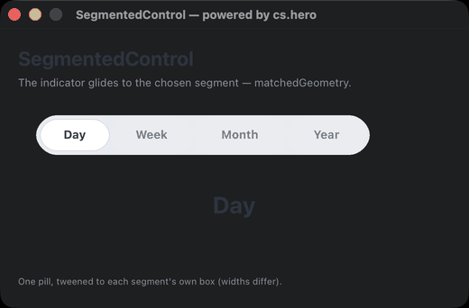

# SegmentedControl

**An animated segmented picker for 4D forms** — the indicator glides to the chosen segment. Built on [Hero](https://github.com/mesopelagique/Hero) (`cs.hero`).

<p align="center"></p>

## Run it

Open the project — `On Startup` shows the demo. Click a segment; the white pill slides under it.

## matchedGeometry, done straight

One **pill** rectangle marks the selection. Choosing another segment tweens the pill to that segment's own box — read from the form, so segments of different widths just work:

```4d
var $seg:=cs.hero.ElementState.new("seg_"+String($i))
Form.transition.animate("pill")\
	.to({left: $seg.left+pad; width: $seg.width-2*pad})\
	.duration(280)\
	.easing("easeInOutCubic")\
	.start()
```

This is the flagship `share()` / matchedGeometryEffect idea in a plain business control, not a game.

## Notes

Each segment is three form objects sharing a box: a hidden marker `seg_<i>` (the geometry the pill flies to), a label `lbl_<i>`, and a transparent `segbtn_<i>` for the click — plain `onClick`, no coordinate maths. Label recolouring reads each label's current background and rewrites only the ink, so a transparent label never turns opaque over the pill.

## `cs.seg.SegmentedControl`

| Function | Action |
|:-|:-|
| `.select(i)` | Move the selection to segment `i` (1-based). |
